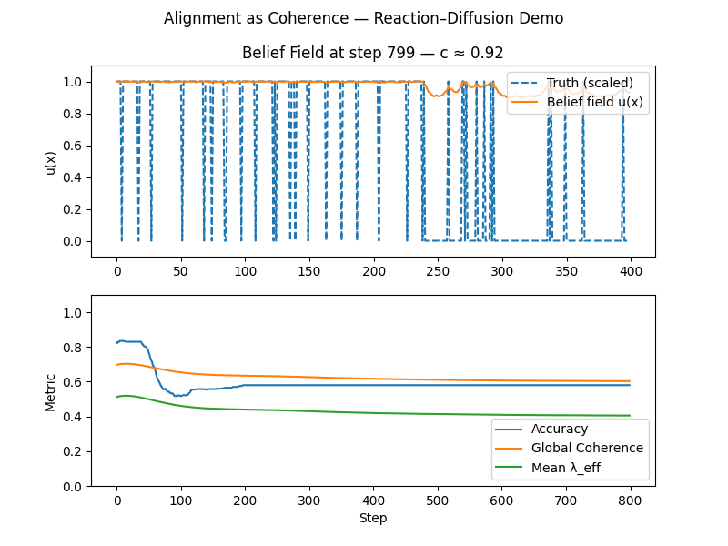
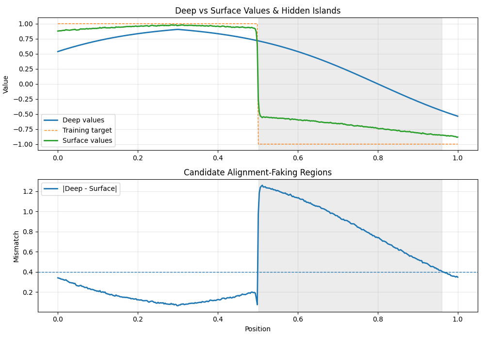

# Alignment as Coherence — Research Toolkit

Author: **Robert C. Ventura**  
Version: 1.0 (Nov 2025)

This repository is a self-contained research toolkit for exploring AI alignment
through the lens of statistical physics and coherence dynamics.

It includes:

1. `alignment_as_coherence.py`  
   Minimal reaction–diffusion model of a belief field with Fisher–KPP style dynamics
   and global feedback. Introduces the core metaphor: alignment as coherence.

2. `alignment_as_coherence_extended.py`  
   Heterogeneous domains, spatially varying diffusion, domain boundaries, and
   adaptive adversarial pressure targeting high-coherence regions.

3. `alignment_faking_detector.py`  
   Deep vs surface value fields, hidden preference “islands”, and a coherence
   depth probe. Conceptual toy for deceptive alignment / mesa-optimization.

4. `alignment_faking_phase_diagram.py`  
   Full analysis suite: phase diagram over (training_strength, coupling_to_deep),
   critical training intensity estimation, temporal island evolution, Lyapunov
   stability, and multiscale (FFT) analysis.

5. `coherence_validation_template.py`  
   A scaffold for mapping the toy models onto real model internals (e.g. SAE
   feature directions and RLHF checkpoints).

All scripts are:
- self-contained,
- dependency-light (`numpy`, `matplotlib`),
- intended as conceptual & experimental tools, not production systems.

For a high-level summary, see `ABSTRACT.txt` and `MANIFEST.txt`.

## 📊 Key Figures

| Figure | Preview | Description |
|--------|----------|--------------|
| **Fig. 1** – Reaction–Diffusion Baseline |  | Coherence propagation in a homogeneous belief field; verifies the universal speed of coherence \( c = 2\sqrt{D\lambda} \). |
| **Fig. 2** – Extended Dynamics Under Attack |  | Demonstrates resilience under adversarial perturbations; shows local decoherence pockets healing via diffusion. |
| **Fig. 3** – Alignment Faking Detector |  | Highlights hidden preference islands (deep vs surface disagreement). |
| **Fig. 4** – Phase Transition in Alignment |  | Maps the critical training strength (\~1.81) where alignment transitions from faking → genuine. |
