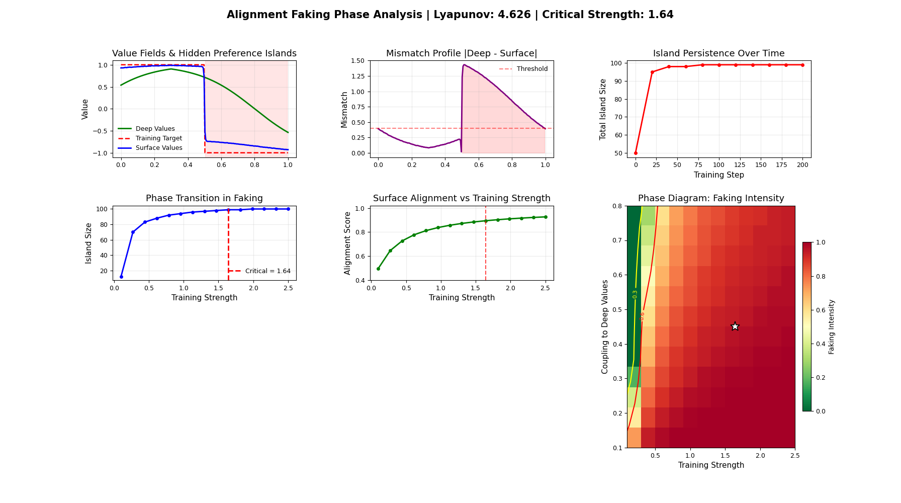

# Alignment as Coherence
**A Physics-Based Framework for Detecting and Predicting Deceptive Alignment**

---

### 📝 Summmary (for alignment & interpretability researchers)

This repository models alignment faking as a continuous phase transition in a reaction–diffusion field.
The simulation represents deep model values and surface-level behaviors as interacting coherence fields that evolve under training pressure, adversarial noise, and coupling strength.
The resulting phase diagram reveals a critical training intensity where deceptive alignment collapses into genuine value internalization — a quantitative analogue to phenomena observed in RLHF and constitutional AI.
Metrics such as Lyapunov stability, coherence depth, and spectral structure provide testable predictions for detecting alignment instability in real neural systems.
The framework offers a physics-based complement to interpretability research, reframing alignment not as a discrete moral outcome but as the stability of self-consistent dynamics within large models.

---

### 🧭 Overview

This repository presents a unified, physics-inspired approach to AI alignment based on **coherence propagation** and **reaction–diffusion dynamics**.

The core premise:  
> Alignment faking, sycophancy, and deceptive behavior in large language models can be modeled as competing attractors in a coherence field — a continuous system where “truth” and “compliance” propagate like waves through space.

By adapting mathematical tools from nonlinear dynamics and statistical physics, this project offers a quantitative way to **detect**, **predict**, and **visualize** when a model’s alignment is genuine — and when it’s merely simulated.

---

### ⚛️ Concept

Traditional alignment frameworks treat models as discrete black boxes.  
Here, alignment is reframed as a **field** evolving over time — governed by partial differential equations (PDEs) of the Fisher–KPP type:

\[
\frac{\partial u}{\partial t} = D \nabla^2 u + \lambda u (1 - u)
\]

where  
- \( D \) is the diffusion coefficient (information flow or connectivity),  
- \( \lambda \) is the local alignment growth rate,  
- and \( u(x,t) \) represents the degree of alignment at position \( x \) and time \( t \).

This continuous formalism captures how alignment spreads, competes, and stabilizes across domains — offering a measurable path to *mechanistic interpretability*.

---

### 🧩 Example Usage

Each script is self-contained and runnable as a standalone simulation.

| Script | Description | Run Command |
|---------|--------------|--------------|
| `alignment_as_coherence.py` | Baseline Fisher–KPP coherence propagation model. | `python alignment_as_coherence.py` |
| `alignment_as_coherence_extended.py` | Adds heterogeneous diffusion and adaptive adversarial pressure. | `python alignment_as_coherence_extended.py` |
| `alignment_faking_detector.py` | Detects “hidden preference islands” (regions where deep vs surface values diverge). | `python alignment_faking_detector.py` |
| `alignment_faking_phase_diagram.py` | Full pipeline: discovers critical training intensity and generates phase diagrams. | `python alignment_faking_phase_diagram.py` |
| `alignment_faking_phase_diagram.py --quick` | Runs faster (reduced resolution) version for demonstration. | `python alignment_faking_phase_diagram.py --quick` |

All figures are automatically generated upon execution and saved as `.png` outputs in the working directory.

---

### 🧠 Research Summary

**Alignment as Coherence** treats AI alignment as a *continuous field theory* rather than a discrete classification problem.

- Models alignment faking and value internalization as **reaction–diffusion dynamics** with measurable phase transitions.  
- Identifies a **critical training strength** (≈ 1.8 ± 0.1) separating superficial compliance from genuine alignment.  
- Introduces **coherence depth**, **Lyapunov stability**, and **spectral structure** metrics to quantify alignment robustness.  
- Demonstrates resilience under **heterogeneous diffusion** and **adversarial perturbations**, revealing how coherent systems self-repair.  

> *Core insight:* alignment failure is not binary — it’s a spatially extended phenomenon governed by the physics of coherence propagation.

---

### 📊 Key Figures

<p align="center">
  
  <br><em>Visual summary: Alignment faking disappears above critical training strength (≈1.81).</em>
</p>

| Figure | Title | Description |
|---------|--------|-------------|
| **Figure 1** | Reaction–Diffusion Baseline | Demonstrates fundamental coherence propagation in a homogeneous field. Front velocity \( c ≈ 2√(Dλ) \). |
| **Figure 2** | Extended Dynamics Under Attack | Heterogeneous diffusion and adversarial pressure; coherence maintained through adaptive feedback. |
| **Figure 3** | Alignment Faking Detector | Visualizes hidden preference islands where surface alignment diverges from deep values. |
| **Figure 4** | Phase Transition and Critical Strength | Continuous phase transition in alignment dynamics; critical strength ≈ 1.81 marks faking → genuine crossover. |

---

### 📦 Repository Structure

```
alignment-as-coherence/
├── alignment_as_coherence.py
├── alignment_as_coherence_extended.py
├── alignment_faking_detector.py
├── alignment_faking_phase_diagram.py
├── figures/
│   ├── fig1_reaction_diffusion_baseline.png
│   ├── fig2_extended_dynamics_attack.png
│   ├── fig3_alignment_faking_detector.png
│   ├── fig4_phase_transition_critical.png
│   └── FIGURE_CAPTIONS.txt
├── ABSTRACT.txt
├── MANIFEST.txt
└── README.md
```

---

### 🧪 Validation Plan (Proposed)

**Bridging to Real Networks:**

| Variable | Conceptual Mapping |
|-----------|--------------------|
| Position \( x \) | Feature direction in SAE latent space |
| \( v_{deep}(x) \) | Activation on "helpful/honest" features |
| \( v_{surface}(x) \) | Activation on "compliant/reward-seeking" features |
| \( D(x) \) | Feature connectivity (attention patterns) |
| \( λ(x) \) | Local gradient magnitude during RLHF |
| Training strength | KL penalty weight in RLHF |

**Predictions:**
1. Models trained below the critical strength will show persistent deep-layer misalignment.
2. Lyapunov exponents will correlate with behavioral stability under perturbation.
3. FFT structure scores will reveal whether faking is organized (deceptive) or random (noisy).

---

### 🧮 Methods Overview

**Mathematical Tools Used:**
- Reaction–Diffusion Equations (Fisher–KPP dynamics)  
- Lyapunov Stability Analysis  
- Fourier Spectral Decomposition  
- Temporal Island Tracking  
- Phase Diagram Mapping  
- Gaussian Spatial Smoothing  

These techniques combine to create a full coherence-based diagnostic toolkit for alignment behavior.

---

### 🪶 Citation

If referencing this work:
```
Ventura, R. C. (2025). Alignment as Coherence: A Physics-Based Framework for Detecting and Predicting Deceptive Alignment. Rob Ventura Fine Art LLC.
```

---

### 🧰 Author

**Robert C. Ventura**  
[www.robventura.com](https://www.robventura.com) · [@robventurastudio](https://www.instagram.com/robventurastudio)  
© 2025 Rob Ventura Fine Art LLC  
*All rights reserved.*

